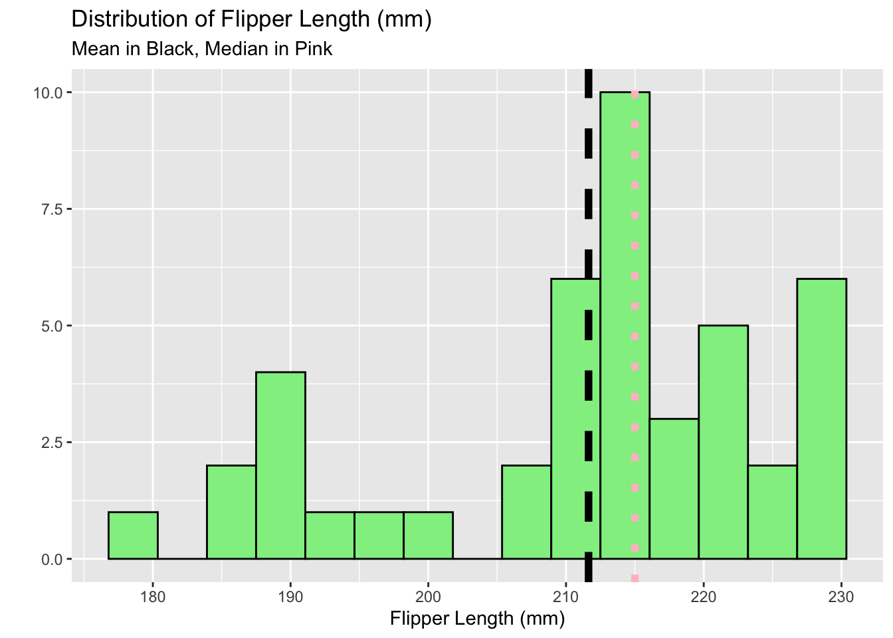
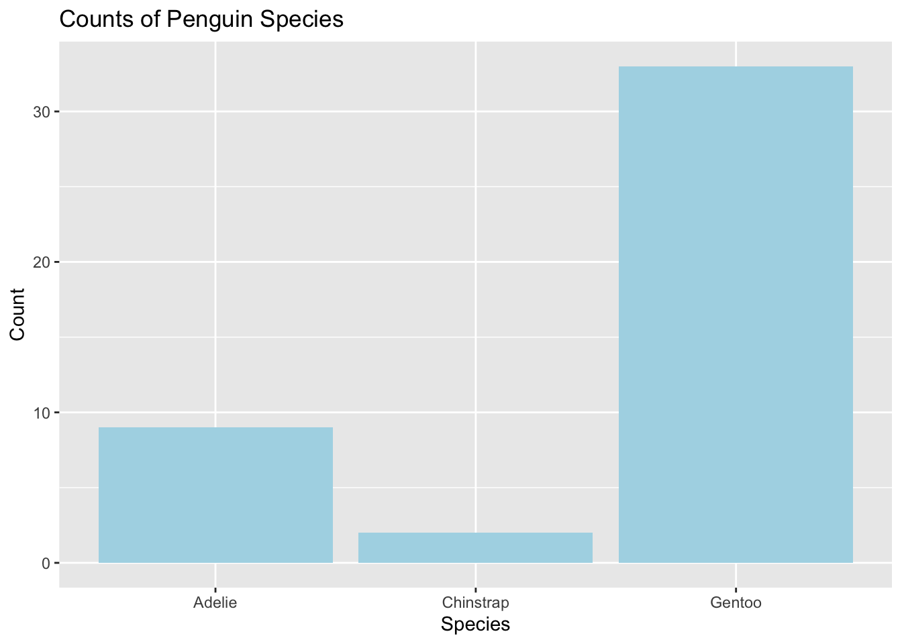
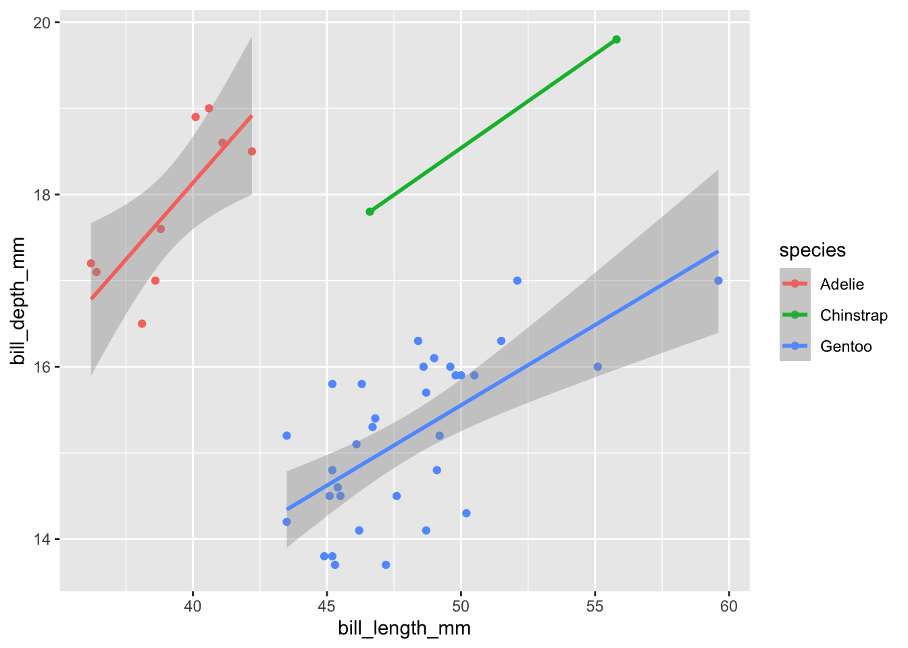

# Palmer Penguins Analysis

This is my first notebook, an analysis of the Palmer Penguins data set.

## Loading Packages and Data sets

Here we will load the tidyverse package and penguins data.


::: {.cell}

```{.r .cell-code}
#Load the tidyverse
library(tidyverse)
```

::: {.cell-output .cell-output-stderr}
```
── Attaching packages ─────────────────────────────────────── tidyverse 1.3.2 ──
✔ ggplot2 3.4.0      ✔ purrr   1.0.0 
✔ tibble  3.1.8      ✔ dplyr   1.0.10
✔ tidyr   1.2.1      ✔ stringr 1.5.0 
✔ readr   2.1.3      ✔ forcats 0.5.2 
── Conflicts ────────────────────────────────────────── tidyverse_conflicts() ──
✖ dplyr::filter() masks stats::filter()
✖ dplyr::lag()    masks stats::lag()
```
:::

```{.r .cell-code}
library(kableExtra)
```

::: {.cell-output .cell-output-stderr}
```

Attaching package: 'kableExtra'

The following object is masked from 'package:dplyr':

    group_rows
```
:::

```{.r .cell-code}
#Read the penguins_samp1 data file from github
penguins <- read_csv("https://raw.githubusercontent.com/mcduryea/Intro-to-Bioinformatics/main/data/penguins_samp1.csv")
```

::: {.cell-output .cell-output-stderr}
```
Rows: 44 Columns: 8
── Column specification ────────────────────────────────────────────────────────
Delimiter: ","
chr (3): species, island, sex
dbl (5): bill_length_mm, bill_depth_mm, flipper_length_mm, body_mass_g, year

ℹ Use `spec()` to retrieve the full column specification for this data.
ℹ Specify the column types or set `show_col_types = FALSE` to quiet this message.
```
:::

```{.r .cell-code}
#See the first six rows of the data we've read in to our notebook
penguins %>% 
  head() %>% 
  kable() %>%
  kable_styling(c("striped", "hover"))
```

::: {.cell-output-display}

`````{=html}
<table class="table table-striped table-hover" style="margin-left: auto; margin-right: auto;">
 <thead>
  <tr>
   <th style="text-align:left;"> species </th>
   <th style="text-align:left;"> island </th>
   <th style="text-align:right;"> bill_length_mm </th>
   <th style="text-align:right;"> bill_depth_mm </th>
   <th style="text-align:right;"> flipper_length_mm </th>
   <th style="text-align:right;"> body_mass_g </th>
   <th style="text-align:left;"> sex </th>
   <th style="text-align:right;"> year </th>
  </tr>
 </thead>
<tbody>
  <tr>
   <td style="text-align:left;"> Gentoo </td>
   <td style="text-align:left;"> Biscoe </td>
   <td style="text-align:right;"> 59.6 </td>
   <td style="text-align:right;"> 17.0 </td>
   <td style="text-align:right;"> 230 </td>
   <td style="text-align:right;"> 6050 </td>
   <td style="text-align:left;"> male </td>
   <td style="text-align:right;"> 2007 </td>
  </tr>
  <tr>
   <td style="text-align:left;"> Gentoo </td>
   <td style="text-align:left;"> Biscoe </td>
   <td style="text-align:right;"> 48.6 </td>
   <td style="text-align:right;"> 16.0 </td>
   <td style="text-align:right;"> 230 </td>
   <td style="text-align:right;"> 5800 </td>
   <td style="text-align:left;"> male </td>
   <td style="text-align:right;"> 2008 </td>
  </tr>
  <tr>
   <td style="text-align:left;"> Gentoo </td>
   <td style="text-align:left;"> Biscoe </td>
   <td style="text-align:right;"> 52.1 </td>
   <td style="text-align:right;"> 17.0 </td>
   <td style="text-align:right;"> 230 </td>
   <td style="text-align:right;"> 5550 </td>
   <td style="text-align:left;"> male </td>
   <td style="text-align:right;"> 2009 </td>
  </tr>
  <tr>
   <td style="text-align:left;"> Gentoo </td>
   <td style="text-align:left;"> Biscoe </td>
   <td style="text-align:right;"> 51.5 </td>
   <td style="text-align:right;"> 16.3 </td>
   <td style="text-align:right;"> 230 </td>
   <td style="text-align:right;"> 5500 </td>
   <td style="text-align:left;"> male </td>
   <td style="text-align:right;"> 2009 </td>
  </tr>
  <tr>
   <td style="text-align:left;"> Gentoo </td>
   <td style="text-align:left;"> Biscoe </td>
   <td style="text-align:right;"> 55.1 </td>
   <td style="text-align:right;"> 16.0 </td>
   <td style="text-align:right;"> 230 </td>
   <td style="text-align:right;"> 5850 </td>
   <td style="text-align:left;"> male </td>
   <td style="text-align:right;"> 2009 </td>
  </tr>
  <tr>
   <td style="text-align:left;"> Gentoo </td>
   <td style="text-align:left;"> Biscoe </td>
   <td style="text-align:right;"> 49.8 </td>
   <td style="text-align:right;"> 15.9 </td>
   <td style="text-align:right;"> 229 </td>
   <td style="text-align:right;"> 5950 </td>
   <td style="text-align:left;"> male </td>
   <td style="text-align:right;"> 2009 </td>
  </tr>
</tbody>
</table>

`````

:::
:::


## About Our Data

The data we are working with is a data set on penguins, which includes 8 features measured on 44 penguins Included features are physiological (including bill length, bill depth, flipper length, body mass, etc.), as well as other features including the year that the penguin was observed, the island it was observed on, the sex of the penguin, and the species of the penguin.

## Interesting Questions to Ask

-   What is the average flipper length? What about for each species?

-   Are there more male or female penguins? What about per island or species?

-   What is the average body mass? What about by island? By species? By sex?

-   What is the ratio of bill length to bill depth for a penguin? What is the overall average of this metric? Does it change by species, sex, or island?

-   Does average body mass change by year?

## Data Manipulation Tools and Strategies

We can look at individual columns in a data set or subsets of columns in a data set. For example, if we are only interested in flipper length and species, we can `select()` those columns.


::: {.cell}

```{.r .cell-code}
penguins %>%
  select(species, body_mass_g)
```

::: {.cell-output .cell-output-stdout}
```
# A tibble: 44 × 2
   species body_mass_g
   <chr>         <dbl>
 1 Gentoo         6050
 2 Gentoo         5800
 3 Gentoo         5550
 4 Gentoo         5500
 5 Gentoo         5850
 6 Gentoo         5950
 7 Gentoo         5700
 8 Gentoo         5350
 9 Gentoo         5550
10 Gentoo         6300
# … with 34 more rows
```
:::
:::


If we want to `filter()` and only show certain rows, we can do that too.


::: {.cell}

```{.r .cell-code}
#We can filter by sex (categorical variables)
penguins %>%
  filter(species == "Chinstrap")
```

::: {.cell-output .cell-output-stdout}
```
# A tibble: 2 × 8
  species   island bill_length_mm bill_depth_mm flipper_le…¹ body_…² sex    year
  <chr>     <chr>           <dbl>         <dbl>        <dbl>   <dbl> <chr> <dbl>
1 Chinstrap Dream            55.8          19.8          207    4000 male   2009
2 Chinstrap Dream            46.6          17.8          193    3800 fema…  2007
# … with abbreviated variable names ¹​flipper_length_mm, ²​body_mass_g
```
:::

```{.r .cell-code}
#We can also filter by numerical variables
penguins %>%
  filter(body_mass_g >= 6000)
```

::: {.cell-output .cell-output-stdout}
```
# A tibble: 2 × 8
  species island bill_length_mm bill_depth_mm flipper_leng…¹ body_…² sex    year
  <chr>   <chr>           <dbl>         <dbl>          <dbl>   <dbl> <chr> <dbl>
1 Gentoo  Biscoe           59.6          17              230    6050 male   2007
2 Gentoo  Biscoe           49.2          15.2            221    6300 male   2007
# … with abbreviated variable names ¹​flipper_length_mm, ²​body_mass_g
```
:::

```{.r .cell-code}
#We can also do both (vertical line means "or")
penguins %>%
  filter((body_mass_g >= 6000 ) | (island == "Torgersen"))
```

::: {.cell-output .cell-output-stdout}
```
# A tibble: 7 × 8
  species island    bill_length_mm bill_depth_mm flipper_l…¹ body_…² sex    year
  <chr>   <chr>              <dbl>         <dbl>       <dbl>   <dbl> <chr> <dbl>
1 Gentoo  Biscoe              59.6          17           230    6050 male   2007
2 Gentoo  Biscoe              49.2          15.2         221    6300 male   2007
3 Adelie  Torgersen           40.6          19           199    4000 male   2009
4 Adelie  Torgersen           38.8          17.6         191    3275 fema…  2009
5 Adelie  Torgersen           41.1          18.6         189    3325 male   2009
6 Adelie  Torgersen           38.6          17           188    2900 fema…  2009
7 Adelie  Torgersen           36.2          17.2         187    3150 fema…  2009
# … with abbreviated variable names ¹​flipper_length_mm, ²​body_mass_g
```
:::
:::


## Answering Our Questions

Most of our questions involve summarizing data, and perhaps summarizing over groups. We can summarize data using the `summarize()` function, and group data using `group_by().`

Let's find the average flipper length.


::: {.cell}

```{.r .cell-code}
#Overall average flipper length
penguins %>%
  summarize(avg_flipper_length = mean(flipper_length_mm))
```

::: {.cell-output .cell-output-stdout}
```
# A tibble: 1 × 1
  avg_flipper_length
               <dbl>
1               212.
```
:::

```{.r .cell-code}
#Single Species Average
penguins %>%
  filter(species == "Gentoo") %>%
  summarize(avg_flipper_length = mean(flipper_length_mm))
```

::: {.cell-output .cell-output-stdout}
```
# A tibble: 1 × 1
  avg_flipper_length
               <dbl>
1               218.
```
:::

```{.r .cell-code}
#Grouped Average           
penguins %>%
  group_by(species) %>%
  summarize(avg_flipper_length = mean(flipper_length_mm))
```

::: {.cell-output .cell-output-stdout}
```
# A tibble: 3 × 2
  species   avg_flipper_length
  <chr>                  <dbl>
1 Adelie                  189.
2 Chinstrap               200 
3 Gentoo                  218.
```
:::
:::


How many of each species do we have?


::: {.cell}

```{.r .cell-code}
penguins %>%
  count(species)
```

::: {.cell-output .cell-output-stdout}
```
# A tibble: 3 × 2
  species       n
  <chr>     <int>
1 Adelie        9
2 Chinstrap     2
3 Gentoo       33
```
:::
:::


Are there more male or female penguins?


::: {.cell}

```{.r .cell-code}
penguins %>%
  count(sex)
```

::: {.cell-output .cell-output-stdout}
```
# A tibble: 2 × 2
  sex        n
  <chr>  <int>
1 female    20
2 male      24
```
:::

```{.r .cell-code}
penguins %>%
  group_by(species) %>%
  count(sex)
```

::: {.cell-output .cell-output-stdout}
```
# A tibble: 6 × 3
# Groups:   species [3]
  species   sex        n
  <chr>     <chr>  <int>
1 Adelie    female     6
2 Adelie    male       3
3 Chinstrap female     1
4 Chinstrap male       1
5 Gentoo    female    13
6 Gentoo    male      20
```
:::
:::


How many penguins were observed on each island? Where can each species be observed?


::: {.cell}

```{.r .cell-code}
penguins %>%
  group_by (island) %>%
  count (species)
```

::: {.cell-output .cell-output-stdout}
```
# A tibble: 5 × 3
# Groups:   island [3]
  island    species       n
  <chr>     <chr>     <int>
1 Biscoe    Adelie        3
2 Biscoe    Gentoo       33
3 Dream     Adelie        1
4 Dream     Chinstrap     2
5 Torgersen Adelie        5
```
:::
:::


We can use `mutate()` to add new columns to our data set.


::: {.cell}

```{.r .cell-code}
#To make a permanent change, we need to store the results of our manipulations
penguins_with_ratio <- penguins %>%
  mutate(bill_ltd_ratio = bill_length_mm / bill_depth_mm)

#Average ratio
penguins %>%
  mutate(bill_ltd_ratio = bill_length_mm / bill_depth_mm) %>%
  summarize (mean_bill_ltd_ratio = mean(bill_ltd_ratio),
             median_bill_ltd_ratio = median(bill_ltd_ratio))
```

::: {.cell-output .cell-output-stdout}
```
# A tibble: 1 × 2
  mean_bill_ltd_ratio median_bill_ltd_ratio
                <dbl>                 <dbl>
1                2.95                  3.06
```
:::

```{.r .cell-code}
#Average Ratio by Group
penguins %>%
  group_by(species) %>%
  mutate(bill_ltd_ratio = bill_length_mm / bill_depth_mm) %>%
  summarize (mean_bill_ltd_ratio = mean(bill_ltd_ratio),
             median_bill_ltd_ratio = median(bill_ltd_ratio))
```

::: {.cell-output .cell-output-stdout}
```
# A tibble: 3 × 3
  species   mean_bill_ltd_ratio median_bill_ltd_ratio
  <chr>                   <dbl>                 <dbl>
1 Adelie                   2.20                  2.20
2 Chinstrap                2.72                  2.72
3 Gentoo                   3.17                  3.13
```
:::
:::


Average body mass by year?


::: {.cell}

```{.r .cell-code}
penguins %>%
  group_by(year) %>%
  summarize(mean_body_mass = mean(body_mass_g))
```

::: {.cell-output .cell-output-stdout}
```
# A tibble: 3 × 2
   year mean_body_mass
  <dbl>          <dbl>
1  2007          5079.
2  2008          4929.
3  2009          4518.
```
:::
:::


## "Rules" for Data Viz

-   One numerical variable - histogram/box plot

-   One categorical variable - barplot

-   Two numerical variables - scatter plot

-   Two categorical variables - barplot with fill

-   One numerical and one categorical variable - side by side box plots, overlaid histograms, "faceting"

## Data Visualization with `ggplot()`

-   What is the distribution of penguin flipper lengths?

-   What is the distribution of penguin species?

-   Does the distribution of flipper length depend on the species of penguin?

-   How many penguins were observed by year?

-   Is there any correlation between bill length and bill depth? (scatter plot)


::: {.cell}

```{.r .cell-code}
penguins %>%
  ggplot() +
  geom_histogram( aes(x = flipper_length_mm), 
                  bins = 15,
                  fill = "lightgreen",
                  color = "black") +
  labs(title = "Distribution of Flipper Length (mm)",
       y = "", x = "Flipper Length (mm)",
       subtitle = "Mean in Black, Median in Pink") +
  geom_vline(aes(xintercept = mean(flipper_length_mm)), linewidth = 2, lty = "dashed") +
  geom_vline(aes(xintercept = median(flipper_length_mm)), color = "pink", linewidth = 2, lty = "dotted")
```

::: {.cell-output-display}
{width=672}
:::
:::


We will now look at the distribution of species.


::: {.cell}

```{.r .cell-code}
penguins %>%
  ggplot() +
  geom_bar(mapping = aes(x = species), fill = "lightblue") +
  labs(title = "Counts of Penguin Species",
       x = "Species", y = "Count")
```

::: {.cell-output-display}
{width=672}
:::
:::


Now lets make a scatter plot to see if bill length is correlated with bill depth.


::: {.cell}

```{.r .cell-code}
penguins %>%
  ggplot() +
  geom_point(aes(x = bill_length_mm, y = bill_depth_mm, color = species)) +
  geom_smooth(aes(x = bill_length_mm, y = bill_depth_mm, color = species), method = "lm")
```

::: {.cell-output .cell-output-stderr}
```
`geom_smooth()` using formula = 'y ~ x'
```
:::

::: {.cell-output .cell-output-stderr}
```
Warning in qt((1 - level)/2, df): NaNs produced
```
:::

::: {.cell-output .cell-output-stderr}
```
Warning in max(ids, na.rm = TRUE): no non-missing arguments to max; returning
-Inf
```
:::

::: {.cell-output-display}
{width=672}
:::
:::
